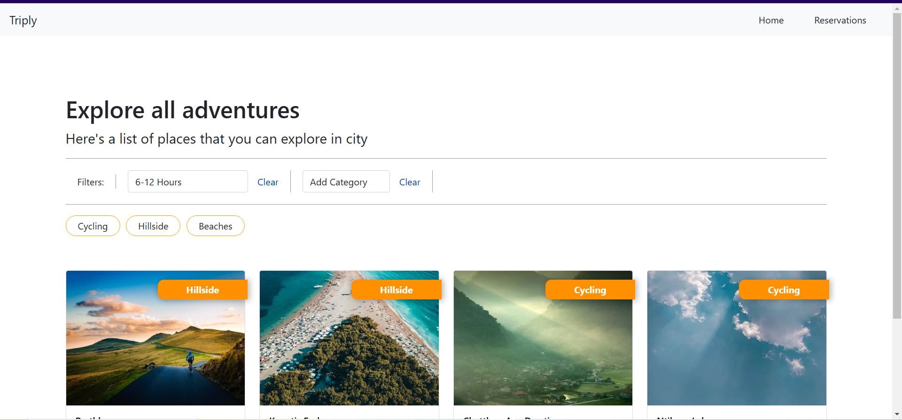
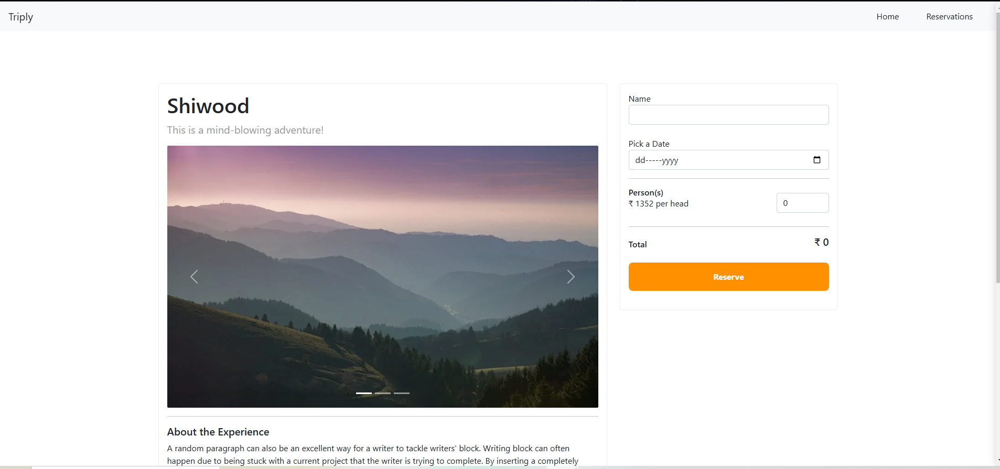
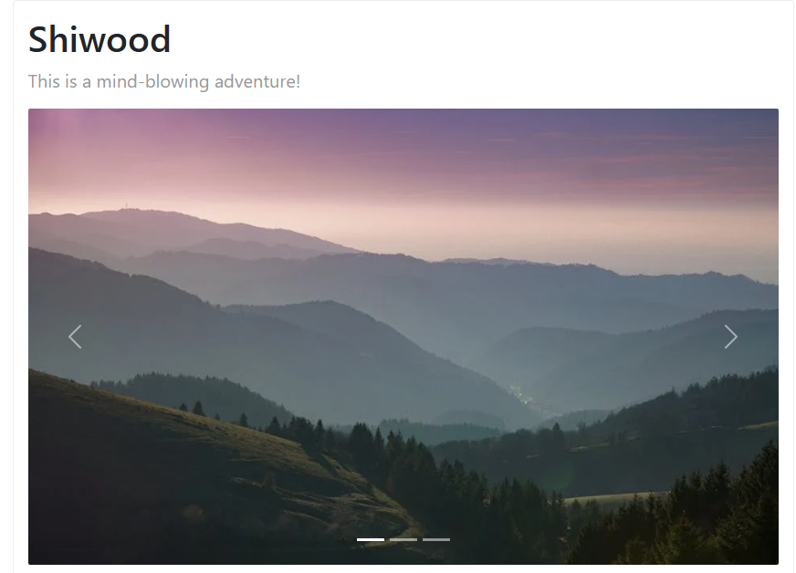
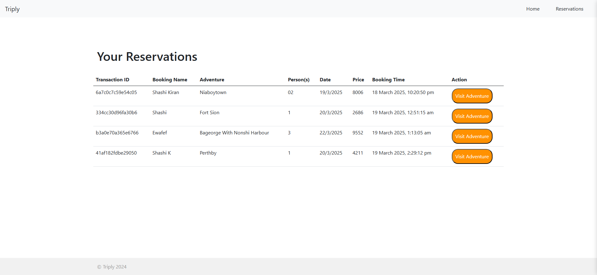
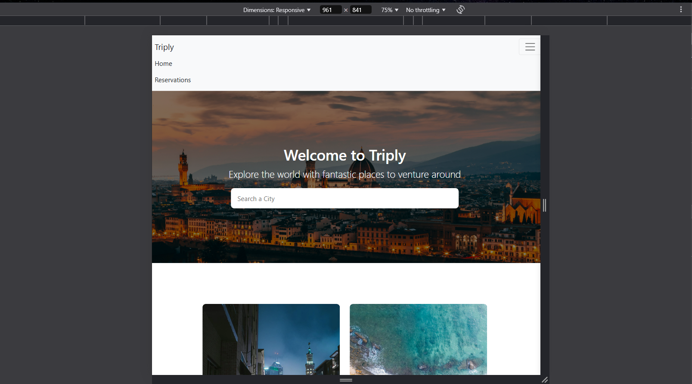
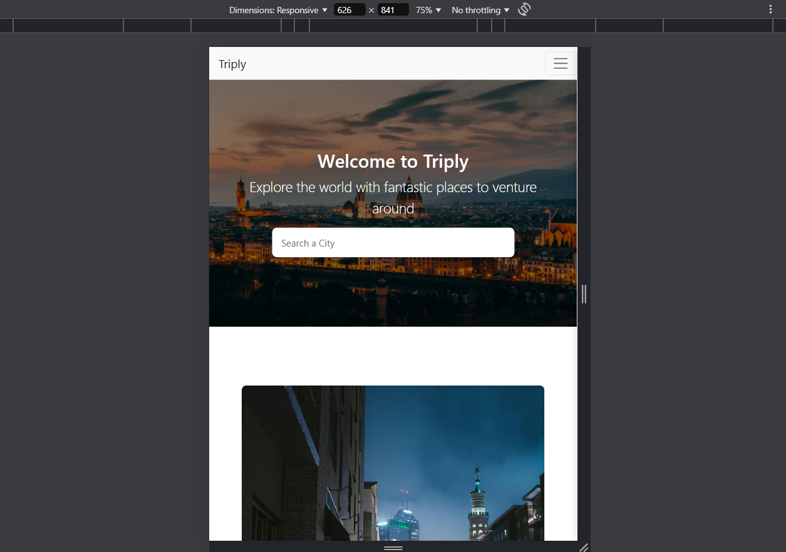

# Triply

Triply is a travel website aimed at travelers looking for a multitude of adventures in different cities. It offers a dynamic and responsive user experience with features such as multi-select filters, image carousels, and persistent user preferences across mobile, tablet, and desktop views.

### Features

- Dynamic web pages using HTML, CSS, and JavaScript
- Multi-select filters and image carousels for improved user experience
- Conditional rendering of page elements
- Persistence of user preferences using localStorage
- Reservation form submission using Fetch API
- Deployment on Netlify/Vercel for Frontend and Render for Backend
- **Responsive design**: Pages are designed to be responsive for all screen resolutions, including mobile, tablet, and desktop views.

### Pages Overview

1. **Landing Page**: This page provides a visually appealing introduction to the website, showcasing a panoramic view of a popular destination. It includes a search bar for visitors to find cities they are interested in exploring.

2. **Adventures Page**: This page lists different adventure activities available for users to explore within a selected city. It features filters to narrow down the search based on duration and categories such as "Cycling Routes", "Hillside Getaways", "Serene Beaches", and "Party Spots".

3. **Adventure Details Page**: After selecting an adventure, users are taken to a detailed page with more information. The page includes a large image carousel to showcase the adventure, along with a brief description.

4. **Reservations Page**: This page displays all the reservations a user has made. It lists the transaction ID, booking name, adventure, person(s), date, price, booking time, and provides an "Visit Adventure" action button for each reservation.

### Screenshots

Here are some screenshots of the key pages:

1. **Landing Page**
   

2. **Adventures Page**
   

3. **Adventure Details Page**
   

4. **Image Carousel on the Adventures Page**
   

5. **Reservations Page**
   

6. **Tablet View**
   

7. **Mobile view**
   

## Video Overview

Here's a video walkthrough of the entire project:


**Click on the image below to watch the video:** 


[](https://youtu.be/3pO0bxh0-1o)


### Getting Started

Follow the instructions below to have a copy of this project up and running on your local machine for development and testing purposes.

#### Prerequisites

- **Node.js**: A JavaScript runtime that allows you to run applications outside the browser.
- **Express.js**: A Node.js web application framework used to build APIs and handle server-side middleware efficiently.
- **NPM**: A package manager for Node.js software packages (comes bundled with Node.js).
- **Bootstrap**: A popular front-end framework for responsive web design.
- **Fetch API**: For making HTTP requests to the backend.
- **localStorage**: For persisting user preferences on the client side.

## Installing the Project

1. Clone the repository to your local machine:
   ```bash
   git clone https://github.com/your-username/Triply.git

2. Navigate to the backend directory:
   ```bash
   cd backend

3. Install dependencies:
   ```bash
   npm install

4. Navigate to the frontend directory:
   ```bash
   cd frontend

5. Install dependencies:
   ```bash
   npm install


### Running the Project

To run the Triply project, follow these steps to start both the backend and frontend.

1. **Update the Backend URL**:
   - Open the `index.js` file located in `Triply/frontend/conf/index.js`.
   - Update the `BackendPoint` variable with the URL of your backend server.
  ```javascript
    // index.js in Triply/frontend/conf/index.js
    const BackendPoint = 'http://your-backend-url.com'; // Update this line
  ```
   

2. Navigate to the backend folder:
   ```bash
   cd backend

3. Start the backend:
   ```bash
   npm start

4. Navigate to the frontend folder:
   ```bash
   cd frontend

5. Install dependencies:
   - Open index.html in your preferred web browser to view the application.
   ```bash
   open index.html

### Built With
- **HTML**: For structuring the web pages.
- **CSS**: For styling the web pages.
- **JavaScript**: For making the web pages dynamic.
- **Bootstrap**: For responsive design and UI components.
- **Node.js**: For the server-side runtime environment.
- **Express.js**: For building the backend API.
- **Fetch API**: For making HTTP requests.
- **localStorage**: For persisting user preferences.

## Project Debrief
**Triply** is a dynamic travel website that provides a seamless experience for users looking to explore different cities and adventures. The application is developed with modern web development standards and offers a wide range of features commonly found in travel platforms.

### Features:
- **Dynamic Web Pages**: Created using HTML, CSS, and JavaScript.
- **User Experience**: Enhanced with multi-select filters and image carousels.
- **Data Handling**: Fetching data from the backend using REST APIs.
- **Persistence**: User preferences are stored using localStorage.
- **Reservation System**: Implemented using Fetch API for form submissions.
- **Deployment**: Deployed on Netlify/Vercel for Frontend and Render for Backend.
- **Responsive Design**: Pages are designed to be responsive for all screen resolutions, including mobile, tablet, and desktop views.

### License
This project is licensed under the MIT License - see the [LICENSE](./LICENSE) file for details.
